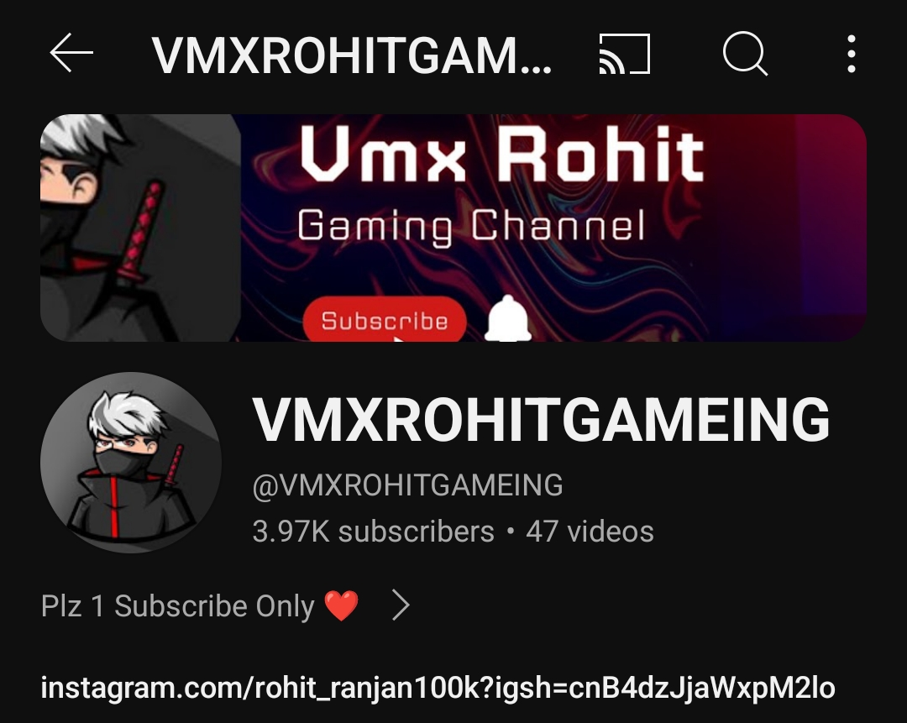

# VMXROHIT


## Table of Contents

- [gamecheatcodes](#gamecheatcodes)
- [My videos](#Myvideos)
- [Licence](#license)
- [Contact](#contact)

## Myvideos
new video uploaded 
https://youtube.com/shorts/2la4CVeTTBM?feature=shorts
# Chat Feature for Your Website

## Overview
This repository contains the code for adding a basic chat feature to your website. Users can send messages to each other in real-time.

## Setup
1. Clone the repository:
   ```bash
   git clone https://github.com/your/repository.git
## Overview
This repository contains the code for adding a basic chat feature to your website. Users can send messages to each other in real-time.

## Setup
1. Clone the repository:
   ```bash
   git clone https://github.com/your/repository.gi
Usage
Include the chat UI component in your webpage:

<HTML>

<div id="chat-container"></div>
<script src="path/to/chat.js"></script>
Initialize the chat in your script:
</HTML>

javascript
Copy code
const chat = new Chat({
  container: 'chat-container',
  serverUrl: 'https://your-backend-url.com/chat',
  userId: 'user123'
});

chat.init();
Features
Real-time messaging
User authentication
Customizable UI
Contributing
Pull requests are welcome. For major changes, please open an issue first to discuss what you would like to change

## License

This project is licensed under the MIT License - see the [LICENCE](LICENCE) file for details.

## Contact

Your Name - Rohit
[rohit.study2022@gmail.com](mailto:rohit.study2022@gmail.com)
my instagram id - itx_rohit_ranjan001
my facebook id -
